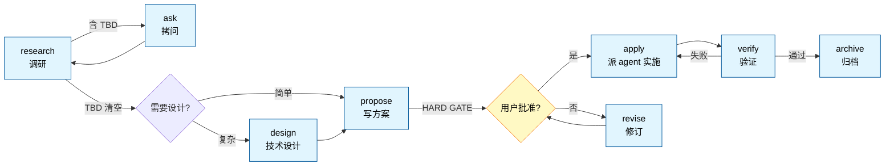

<div align="center">

# kamioj-sdd

**Spec-driven development plugin for Claude Code**

让大改动可控可回滚——调研、拷问、提案、HARD GATE、实施、验证、归档，每步可重入、可硬约束、可派单。

[](https://github.com/kamioj/kamioj-sdd)
[](https://github.com/kamioj/kamioj-sdd)
[](https://docs.claude.com/en/docs/claude-code)
[](LICENSE)

</div>

---

## Why

AI 辅助的 spec-driven development 已有两种范式：

- **快流**：直接动手，hook 兜底（hookify / superpowers brainstorm 简版）
- **重流**：先 spec 后做，但流程僵化（OpenSpec 4 命令、superpowers brainstorm 9 步）

**kamioj-sdd 走第三路**：保留"先想清楚再动手"的价值，但把流程拆成 11 个独立 slash 命令——每阶段可重入、可中断、可单点重做。配 2 个硬约束 hook，让"该停的地方真停下来"。

### Comparison

| 维度 | kamioj-sdd | OpenSpec | superpowers |
|---|---|---|---|
| 阶段控制 | 显式 HARD GATE + hook 拦截 | fluid 软警告 | 9 步硬流程 |
| 待决点 `[TBD]` | 允许 + hook 强制清空 | Open Questions 可滞留 | 严禁，必须当场消解 |
| 命令粒度 | 11 个独立命令 | 4 命令一把梭 | skill-based 单流程 |
| 中途重入 | 每阶段独立调用 | `/opsx:continue` 推进 | 重头来 |
| 反作弊精神 | 命令 + agent 双层 + opt-in flag | 无 | 隐含 |

定位：**单人 + 大改动 + 防呆机制**——比 OpenSpec 严，比 superpowers 灵活。

---

## Quick Start

### Install

```pwsh
# 配 GitHub token（private repo 必需）
$env:GITHUB_TOKEN = "ghp_xxxxxxxxxxxx"

# 注册 marketplace + 装 plugin
claude plugin marketplace add kamioj/kamioj-sdd
claude plugin install sdd@kamioj-sdd
```

### Try it

启动 claude 后：

```
/sdd:status                          # 应输出"无活跃 SDD change"
/sdd:research "Caffeine vs Redis"    # 开一个调研
```

3 分钟内 `research.md` 会落在 `spec/changes/caffeine-vs-redis/` 目录里。

---

## Features

### 11 个独立 slash 命令

| 类别 | 命令 | 做什么 |
|---|---|---|
| **入口** | `/sdd:auto <task>` | 全流程一把梭 |
|  | `/sdd:status` | 报告当前 change 在哪一步 |
| **信息收集** | `/sdd:research <方向>` | 调研业界做法，标 `[TBD]` |
|  | `/sdd:ask` | 拷问消化 `[TBD]` |
|  | `/sdd:chat` | 讨论模式，不动文档 |
| **设计 & 方案** | `/sdd:design` | 技术设计梳理（按需） |
|  | `/sdd:propose` | 写 proposal + HARD GATE |
|  | `/sdd:revise [why\|what\|how\|risk]` | 局部改 proposal |
| **执行 & 验证** | `/sdd:apply [flags]` | 派 agent 实施 |
|  | `/sdd:verify` | 三维验证（completeness / correctness / coherence） |
| **收尾** | `/sdd:archive` | 归档当前 change |

### 2 个硬约束 Hook

通过 `UserPromptSubmit` 事件，**shell 脚本拦截**违反流程的命令：

| Hook | 何时拦 | 拦什么 |
|---|---|---|
| `check-tbd.ps1` | `/sdd:propose` 之前 | research.md 还有 `[TBD-N]` 就拒绝执行 |
| `check-gate.ps1` | `/sdd:apply` 之前 | proposal.md 缺 `<!-- APPROVED -->` 就拒绝 |

**软约束 vs 硬约束**：prompt 里写"必须做 X"，模型可能违反；hook 是 shell 脚本拦截，**违反率 0**。

### 2 个开发 Agent

| Agent | 触发场景 |
|---|---|
| `sdd-frontend-dev` | UI / 路由 / 组件 / 样式 / 客户端交互 |
| `sdd-backend-dev` | 服务端逻辑 / API / 数据模型 / DB 迁移 / 中间件 |

跨前后端项目，接口契约先固化在 `design.md ## Interfaces`，两个 agent **并行实施**（不串行）。

### opt-in 增强 flag

`/sdd:apply` 默认轻量。三个 flag 按需启用：

| flag | 启用规则 | 适用场景 |
|---|---|---|
| `design` | 反 AI slop | 营销页 / 作品集 / 视觉重要的前端 |
| `solid` | 反偷懒（禁 workaround） | 一次性脚本怕走捷径 |
| `verify` | 反幻觉（先读再写） | 复杂代码库怕乱猜 |

可组合：

```
/sdd:apply design solid verify    # 三件套全启
```

---

## Workflow



每个阶段独立。不顺手随时跳——`/sdd:chat` 讨论、`/sdd:revise why` 改某段、`/sdd:research <新方向>` 重做调研。

---

## Architecture

### Repo layout

```
.
├── .claude-plugin/marketplace.json    # marketplace 清单
└── plugins/sdd/
    ├── .claude-plugin/plugin.json     # plugin 清单
    ├── commands/                       # 11 个 slash 命令
    ├── hooks/                          # 硬约束（pwsh 实现）
    │   ├── hooks.json
    │   ├── check-tbd.ps1
    │   └── check-gate.ps1
    ├── agents/                         # 开发 agent
    │   ├── sdd-frontend-dev.md
    │   └── sdd-backend-dev.md
    └── skills/sdd/
        ├── SKILL.md                    # plugin 总览（共享精神）
        └── references/                 # 知识库
            ├── proposal-spec.md        # 产物 spec：完整格式 + HARD GATE 规则
            ├── research-spec.md
            ├── design-spec.md
            ├── tasks-spec.md
            ├── agent-principles.md     # opt-in: 反偷懒 + 反幻觉
            ├── frontend-aesthetics.md  # opt-in: 反 AI slop
            ├── alibaba-java.md         # 14 个语言/框架规范
            ├── bulletproof-react.md
            ├── vue-style.md vue-patterns.md
            ├── react-patterns.md
            ├── ts-conventions.md google-ts-style.md
            ├── python-conventions.md php-conventions.md
            ├── flutter-conventions.md
            ├── js-style.md css-style.md
            └── uniapp-miniprogram.md
```

### Runtime artifacts

在你的项目里跑 sdd plugin 时产生的文件：

```
<your-project>/spec/
├── changes/<change-name>/          # 活跃 change 工作区
│   ├── research.md   必有          # 调研笔记 + 待决点
│   ├── design.md     可选          # 技术设计（架构 / 接口 / 数据模型）
│   ├── proposal.md   必有          # 方案终态（含 APPROVED 标记）
│   ├── tasks.md      可选          # 多执行体协作清单
│   └── archive/                    # 重做时的旧产物备份
└── archive/<YYYY-MM-DD-name>/      # 已归档 change
```

---

## Development

修改 plugin 内容后：

```pwsh
git add . && git commit -m "..."
git push

claude plugin marketplace update kamioj-sdd    # 同步 cache
# 重启 claude（hook 必须重启加载）
```

或开发期跳过 push 循环，直接加载本地源码：

```pwsh
claude --plugin-dir ./plugins/sdd
```

`--plugin-dir` 加载的副本**优先级高于** marketplace cache，改了立刻能测。

---

## Documentation

- [plugins/sdd/README.md](plugins/sdd/README.md) — Plugin 详细文档（11 命令深度说明 / hook / agent / flag / 设计哲学）
- [plugins/sdd/skills/sdd/SKILL.md](plugins/sdd/skills/sdd/SKILL.md) — 共享精神（HARD GATE / 拷问规则 / 卡死保护 / 反作弊）
- [Claude Code Plugin 官方文档](https://code.claude.com/docs/en/plugins) — 上游 plugin 机制参考

---

## Limitations

- **Windows-only**：hook 用 pwsh 写，目前只跑 Windows。跨平台需要 bash / sh 等价
- **未做的扩展**：sdd-researcher / sdd-reviewer 专属 agent / MCP server / Stop hook（任务遗忘提醒）

---

## License

本仓库**自有代码**（commands / hooks / agents / skills 等我们写的部分）采用 [MIT License](LICENSE)。

**第三方内容声明**：

- `plugins/sdd/skills/sdd/references/` 下含 14 个语言 / 框架规范文件（alibaba-java、bulletproof-react、airbnb-javascript-style 等），版权归各自原作者，本项目仅作个人引用学习
- `agent-principles.md` 与 `frontend-aesthetics.md` 含 [Anthropic 官方提示词原文](https://code.claude.com/docs/)，版权归 Anthropic，本项目仅供个人在私有环境引用

如未来公开发布到社区，需要：
1. 清理 references/ 或替换为自有内容
2. 移除或显著改写 Anthropic 提示词引用
3. 更新此 License 段

---

<div align="center">

Built with [Claude Code](https://claude.com/claude-code) · Maintained by [@kamioj](https://github.com/kamioj)

</div>
