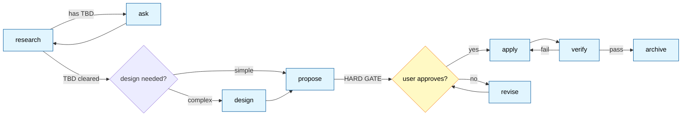

<div align="center">

# spec-workflow

**Spec-driven development plugin for Claude Code**

Large changes, kept controllable and reversible. The pipeline — research → clarify → propose → **HARD GATE** → implement → verify → archive — is re-entrant at every step, enforced by hooks, and runs its agents in parallel.

[](https://github.com/kamioj/spec-workflow)
[](https://github.com/kamioj/spec-workflow)
[](https://docs.claude.com/en/docs/claude-code)
[](LICENSE)

**English** | [中文](README_cn.md)

</div>

---

## Why

Two paradigms already dominate AI-assisted spec-driven development:

- **Fast lane** — start coding right away and let hooks catch the mistakes (hookify, or a stripped-down superpowers brainstorm).
- **Heavy lane** — spec everything up front, but down a rigid track (OpenSpec's 4 commands, superpowers brainstorm's 9 steps).

**spec-workflow takes a third path.** It keeps the discipline of thinking before acting, but breaks the process into 11 independent slash commands — each stage re-entrant, interruptible, and re-runnable on its own. Three hard gate hooks make sure the workflow stops where it has to; a Stop-event reminder makes sure implementation ends with a verification.

### Comparison

| Dimension | spec-workflow | OpenSpec | superpowers |
|---|---|---|---|
| Stage gating | explicit HARD GATE + hook enforcement | loose, advisory warnings | rigid 9-step track |
| Open questions `[TBD]` | allowed, but a hook forces them closed | Open Questions can linger | banned — resolve on the spot |
| Command granularity | 11 independent commands | 4 commands, all-in-one | one skill-based flow |
| Mid-flow re-entry | call any stage on its own | `/opsx:continue` to advance | start over |
| Anti-cheating | two layers (command + agent) + opt-in flags | none | implicit |

Built for one person making large changes, with guardrails — stricter than OpenSpec, looser than superpowers.

---

## Quick Start

### Install

```pwsh
# Configure a GitHub token (required for a private repo)
$env:GITHUB_TOKEN = "ghp_xxxxxxxxxxxx"

# Register the marketplace and install the plugin
claude plugin marketplace add kamioj/spec-workflow
claude plugin install spec@spec-workflow
```

### Optional dependencies (not auto-installed — the plugin degrades gracefully without them)

A Claude Code plugin only ships files (commands / hooks / agents / rules); it never installs software on your machine. Two external tools unlock extra layers, both opt-in:

| Tool | Powers | Install | Without it |
|---|---|---|---|
| [ast-grep](https://github.com/ast-grep/ast-grep) | charter-audit machine pass over `rules/dirty-data/` (AST-level detection of swallowed exceptions / default-return fallbacks) | `scoop install main/ast-grep` or `npm i -g @ast-grep/cli` | the verifier falls back to manual pattern review and declares `not run: ast-grep not installed` in Evidence |
| Codex CLI | the `--codex` heterogeneous peer review in `/spec:propose` and `/spec:verify` | `npm i -g @openai/codex`, then run `codex` once — the first run walks you through login | `--codex` flags unavailable; the default independent review is unaffected |

### Try it

Once claude is running:

```
/spec:status                          # should print "no active SDD change"
/spec:research "Caffeine vs Redis"    # kick off a research run
```

Within a few minutes, `research.md` lands in `spec/changes/caffeine-vs-redis/`.

From there, walk the flow: `/spec:ask` settles the open `[TBD]` decisions with you → `/spec:propose` writes the proposal and **stops at the HARD GATE for your approval** → `/spec:apply` implements → `/spec:verify` audits independently → say "archive" when you're done. Lost? `/spec:status` tells you exactly where you are and what to run next.

---

## Features

### 11 independent slash commands

| Category | Command | What it does |
|---|---|---|
| **Entry** | `/spec:workflow <task>` | run the whole flow end-to-end |
|  | `/spec:status` | report where the current change stands |
| **Gather** | `/spec:research <direction>` | survey industry practice and flag open questions as `[TBD]` |
|  | `/spec:ask` | work through the `[TBD]` questions with you |
|  | `/spec:chat` | discussion mode — never touches a file |
| **Design & propose** | `/spec:design` | technical design, when you need it |
|  | `/spec:propose [--codex]` | write the proposal + HARD GATE; `--codex` lets codex poke holes in it |
|  | `/spec:revise [why\|what\|how\|risk]` | edit a single proposal section |
| **Execute & verify** | `/spec:apply [flags]` | dispatch agents to implement |
|  | `/spec:verify [--codex] [--fix]` | independent fresh-context verifier review (three dimensions + charter audit); `--codex` adds a second opinion from codex, `--fix` lets codex edit directly |
| **Wrap up** | `/spec:archive` | archive the current change |

### 4 hooks — 3 hard gates + 1 reminder

On the `UserPromptSubmit` event, **shell scripts block** any command that breaks the flow; on the `Stop` event, a reminder catches implementation ending without verification:

| Hook | Fires on | What it does |
|---|---|---|
| `check-tbd.ps1` | before `/spec:propose` | blocks if research.md still has a `[TBD-N]` |
| `check-gate.ps1` | before `/spec:apply` | blocks if the proposal isn't ready: missing / incomplete proposal.md (four sections), or more than one active change |
| `check-archive.ps1` | before `/spec:archive` | blocks if the change bypassed the flow (unapproved proposal / unchecked tasks / no proposal); override deliberately with `force` or `abandoned` |
| `check-verify-reminder.ps1` | Stop (end of a Claude turn) | nudges Claude to run the closing verification when a turn ends with an approved proposal but no `verify.md` ledger (one nudge per stop, loop-guarded) |

**Soft vs hard constraints.** A prompt that says "you must do X" can be ignored by the model. A hook is a shell script — it can't be: a **0% violation rate**.

### 1 development agent (dispatched by scope)

| scope | Responsible for |
|---|---|
| `frontend` | UI / routing / components / styling / client-side interaction |
| `backend` | server-side logic / API / data models / DB migrations / middleware |

`spec-dev` is a single agent; frontend/backend is a dispatch-time scope. In a cross-stack project, the interface contract is pinned down first in `design.md ## Interfaces`, then **two `spec-dev` instances** (one frontend, one backend) **build in parallel** — never one after the other.

### 1 verification agent (fresh context)

`spec-verifier` is dispatched by `/spec:verify` with a **deliberately fresh context** — the conversation that implemented the change never audits itself. Its protocol: no pass without fresh evidence (a dev agent's self-reported success gets re-run, not trusted), evidence-or-drop findings (no quotable code = no finding, ≤3 per dimension), a refutation phase where a defense must cite a gate decision, and an ast-grep machine pass over the shipped `rules/dirty-data/` pack (validated: catches "return default in catch" even behind a log line; never flags a proper throw).

### opt-in enhancement flags

`/spec:apply` runs lean by default. Three flags pull in extra discipline on demand:

| flag | Turns on | Use it when |
|---|---|---|
| `design` | anti-AI-slop | marketing pages, portfolios — anywhere visuals matter |
| `solid` | anti-laziness (no workarounds) | one-off scripts where cutting corners is tempting |
| `verify` | anti-hallucination (read before you write) | large codebases where guessing is dangerous |

Stack them:

```
/spec:apply design solid verify    # all three on
```

---

## Workflow



Every stage stands alone. Jump wherever you need — `/spec:chat` to talk it over, `/spec:revise why` to rework one section, `/spec:research <new direction>` to start the research over.

---

## Architecture

### Repo layout

```
.
├── .claude-plugin/
│   ├── marketplace.json           # marketplace manifest (source: "./" — points back at the repo root)
│   └── plugin.json                # plugin manifest
├── commands/                       # 11 slash commands
├── hooks/                          # hard constraints (pwsh)
│   ├── hooks.json
│   ├── check-tbd.ps1
│   ├── check-gate.ps1
│   ├── check-archive.ps1
│   └── check-verify-reminder.ps1
├── agents/
│   ├── spec-dev.md                 # dispatched by scope (frontend/backend); cross-stack = two in parallel
│   └── spec-verifier.md            # fresh-context verifier dispatched by /spec:verify
├── rules/                          # ast-grep rule packs (charter-audit machine pass)
│   ├── sgconfig.yml
│   └── dirty-data/                 # swallowed exceptions / default-return fallbacks (java/js/ts)
├── scripts/
│   └── codex-exec.ps1              # wrapper for every --codex invocation (timeout / session reuse / Windows workarounds)
└── skills/core/
    ├── SKILL.md                    # plugin overview (shared principles)
    └── references/                 # knowledge base
        ├── proposal-spec.md        # artifact spec: full format + HARD GATE rules
        ├── design-spec.md
        ├── tasks-spec.md
        ├── agent-principles.md     # opt-in: anti-laziness + anti-hallucination
        ├── frontend-aesthetics.md  # opt-in: anti-AI-slop
        ├── code-charter.md         # coding-phase baseline: fail-fast / no silent fallback / no old-logic fallback
        ├── alibaba-java.md         # 14 language/framework guides
        ├── bulletproof-react.md
        ├── vue-style.md vue-patterns.md
        ├── react-patterns.md
        ├── ts-conventions.md google-ts-style.md
        ├── python-conventions.md php-conventions.md
        ├── flutter-conventions.md
        ├── js-style.md css-style.md
        └── uniapp-miniprogram.md
```

### Runtime artifacts

What the plugin writes into your project when you run it:

```
<your-project>/spec/
├── knowledge.md                    # project-level durable facts (cross-change; archive maintains, research reads first)
├── changes/<change-name>/          # active change workspace
│   ├── research.md   required      # current research (practices + constraints + open decisions), single file
│   ├── research/     optional      # discarded-direction drafts for this change (research.md snapshots, no markers/links, revivable)
│   ├── design.md     optional      # technical design (architecture / interfaces / data model)
│   ├── proposal.md   required      # the final solution (carries the APPROVED marker)
│   ├── tasks.md      optional      # multi-executor task list
│   ├── verify.md     at-verify     # verification ledger: stable finding IDs + round diffing + unfixed-escalation
│   └── retrospect.md at-archive    # written by /spec:archive: divergence review + evidence + leftovers
└── archive/<YYYY-MM-DD-name>/      # archived changes
```

---

## Development

After changing plugin content:

```pwsh
git add . && git commit -m "..."
git push

claude plugin marketplace update spec-workflow    # sync the cache
# restart claude — hooks only load on startup
```

Or skip the push loop while developing and load the source directly:

```pwsh
claude --plugin-dir .
```

A copy loaded with `--plugin-dir` **wins over** the marketplace cache, so your edits are testable right away.

---

## Documentation

- [skills/core/SKILL.md](skills/core/SKILL.md) — shared principles (HARD GATE / interrogation rules / stuck-detection / anti-cheating)
- [Official Claude Code plugin docs](https://code.claude.com/docs/en/plugins) — the upstream plugin mechanism

---

## Limitations

- **Windows-only.** Hooks are written in pwsh and run on Windows for now; going cross-platform needs a bash/sh equivalent.
- **Not built yet.** Dedicated sdd-researcher / sdd-reviewer agents, an MCP server.

---

## Integration

How this plugin cooperates with the global CLAUDE.md protocol:

- **Language** — proposal and research prose follows your working language; section headers stay in English (## Why / ## What / ## How / ## Risk) so tools can spot them and `revise` can target them by name.
- **Subagent delegation** — the research stage hands off to the global `@researcher`; the apply stage hands off to the in-plugin `spec-dev` (dispatched by scope).
- **Concurrency** — independent tasks are dispatched all at once.

---

## Verified Decisions

Design calls I worried about, then confirmed safe after digging in (evidence cites Claude Code's official plugin-dev plugin and hookify sources — install those to re-verify):

| Item | Verdict | Evidence |
|---|---|---|
| `user_prompt` field name | ✅ correct | hookify/core/rule_engine.py lines 226–228 read `input_data.get('user_prompt', '')` |
| how to invoke a plugin agent | ✅ use the agent name directly (`spec-dev`) — no plugin prefix | plugin-dev/skills/agent-development/SKILL.md § Namespacing |
| required agent frontmatter | ✅ name / description / model / color all present | plugin-dev/skills/agent-development/SKILL.md § Frontmatter Fields |
| agent model strategy | ✅ `inherit` (takes the parent conversation's model — the official recommendation) | plugin-dev/skills/agent-development/SKILL.md § model |

---

## Changelog

- **0.2.1 – 0.2.3** — live-fire hardening from the first real runs and two independent audits:
  - verifier output enum discipline (0.2.1)
  - gate hooks trigger on invocation only, never on mention — "what does /spec:apply do?" passes through (0.2.2)
  - the apply gate now checks prerequisites (proposal exists + four sections + single change) instead of the APPROVED marker, fixing a happy-path deadlock where the hook demanded a marker that only apply itself could append; `--codex` tool permissions repaired (`/spec:propose --codex` was unable to run its script); doc drift swept (0.2.3)
- **0.2.0**
  - HARD GATE gains an explanation layer: Changes written for the decision-maker (scenario → how the decision avoids it → cost), with mandatory "Decided without asking" and "Not in this change" disclosures
  - proposal `## What`: every item carries a `verify:` acceptance check; the section closes with an explicit **Not in this change** boundary that flows into agent dispatch prompts and verify exclusion zones
  - `/spec:verify` now dispatches an independent fresh-context `spec-verifier` agent (evidence-or-drop findings, refutation phase, optional ast-grep machine pass via `rules/dirty-data/`) and writes a verification ledger `verify.md` (stable finding IDs, round diffing, unfixed findings escalate to fail)
  - Charter audit: fallback / degrade / compat paths must trace to a gate decision — untraceable ones are findings (critical on data-write paths); the spec-dev summary must disclose every fallback and carry an Evidence block
  - Two new hooks: `check-archive.ps1` (blocks archiving a change that bypassed the flow; override with `force`/`abandoned`) and `check-verify-reminder.ps1` (Stop event: a turn can't quietly end with an approved proposal and no verification ledger)
  - New artifacts: archive-stage `retrospect.md` (divergence review + evidence) and project-level `spec/knowledge.md` (durable cross-change facts; archive maintains, research reads first)
  - tasks.md generation is declared at the gate (trigger + split), never silently attached
- **0.1.0** — first release: 11 commands, 2 hooks, 1 agent; migrated from an earlier skill-only form.

---

## License

Released under the [MIT License](LICENSE).

**About `references/`:**

- Everything here is sdd's **own content**. The tech-stack guides (`js-style`, `vue-style`, `google-ts-style`, `alibaba-java`, …) distill the key points of the corresponding official specs, with the source noted in each file's frontmatter `source` field — for the full spec, follow the official link; this project does not reproduce the original text.
- `bulletproof-react.md` is a key-points summary of [bulletproof-react](https://github.com/alan2207/bulletproof-react) (MIT).
- The principles in `agent-principles.md` and `frontend-aesthetics.md` are original write-ups, synthesized from common industry engineering and design consensus.

---

<div align="center">

Built with [Claude Code](https://claude.com/claude-code) · Maintained by [@kamioj](https://github.com/kamioj)

</div>
