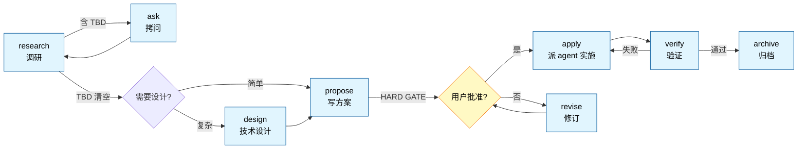

<div align="center">

# spec-workflow

**Spec-driven development plugin for Claude Code**

让大改动可控可回滚——调研、拷问、提案、HARD GATE、实施、验证、归档，每步可重入、可硬约束、可派单。

[](https://github.com/kamioj/spec-workflow)
[](https://github.com/kamioj/spec-workflow)
[](https://docs.claude.com/en/docs/claude-code)
[](LICENSE)

[English](README.md) | **中文**

</div>

---

## Why

AI 辅助的 spec-driven development 已有两种范式：

- **快流**：直接动手，hook 兜底（hookify / superpowers brainstorm 简版）
- **重流**：先 spec 后做，但流程僵化（OpenSpec 4 命令、superpowers brainstorm 9 步）

**spec-workflow 走第三路**：保留"先想清楚再动手"的价值，但把流程拆成 11 个独立 slash 命令——每阶段可重入、可中断、可单点重做。配 2 个硬约束 hook，让"该停的地方真停下来"。

### Comparison

| 维度 | spec-workflow | OpenSpec | superpowers |
|---|---|---|---|
| 阶段控制 | 显式 HARD GATE + hook 拦截 | fluid 软警告 | 9 步硬流程 |
| 待决点 `[TBD]` | 允许 + hook 强制清空 | Open Questions 可滞留 | 严禁，必须当场消解 |
| 命令粒度 | 11 个独立命令 | 4 命令一把梭 | skill-based 单流程 |
| 中途重入 | 每阶段独立调用 | `/opsx:continue` 推进 | 重头来 |
| 反作弊精神 | 命令 + agent 双层 + opt-in flag | 无 | 隐含 |

定位：**单人 + 大改动 + 防呆机制**——比 OpenSpec 严，比 superpowers 灵活。

---

## Quick Start

### Install

```pwsh
# 配 GitHub token（private repo 必需）
$env:GITHUB_TOKEN = "ghp_xxxxxxxxxxxx"

# 注册 marketplace + 装 plugin
claude plugin marketplace add kamioj/spec-workflow
claude plugin install spec@spec-workflow
```

### Try it

启动 claude 后：

```
/spec:status                          # 应输出"无活跃 SDD change"
/spec:research "Caffeine vs Redis"    # 开一个调研
```

3 分钟内 `research.md` 会落在 `spec/changes/caffeine-vs-redis/` 目录里。

---

## Features

### 11 个独立 slash 命令

| 类别 | 命令 | 做什么 |
|---|---|---|
| **入口** | `/spec:workflow <task>` | 全流程一把梭 |
|  | `/spec:status` | 报告当前 change 在哪一步 |
| **信息收集** | `/spec:research <方向>` | 调研业界做法，标 `[TBD]` |
|  | `/spec:ask` | 拷问消化 `[TBD]` |
|  | `/spec:chat` | 讨论模式，不动文档 |
| **设计 & 方案** | `/spec:design` | 技术设计梳理（按需） |
|  | `/spec:propose [--codex]` | 写 proposal + HARD GATE；`--codex` 让 codex 挑刺方案 |
|  | `/spec:revise [why\|what\|how\|risk]` | 局部改 proposal |
| **执行 & 验证** | `/spec:apply [flags]` | 派 agent 实施 |
|  | `/spec:verify [--codex] [--fix]` | 三维自审；`--codex` codex 异构他审，`--fix` codex 直接改 |
| **收尾** | `/spec:archive` | 归档当前 change |

### 2 个硬约束 Hook

**shell 脚本拦截**违反流程的动作——一个挂 `UserPromptSubmit`，一个挂 `PreToolUse`：

| Hook | 事件 / 触发 | 拦什么 |
|---|---|---|
| `check-tbd.ps1` | UserPromptSubmit · `/spec:propose` | research.md 还有 `[TBD-N]` 就拒绝 |
| `check-source-gate.ps1` | PreToolUse · `Write\|Edit\|MultiEdit` | 写 `spec/` 外源码、但活跃 change 未 APPROVED 或契约指纹漂移 → 拒绝 |

**软约束 vs 硬约束**：prompt 里写"必须做 X"，模型可能违反；hook 是 shell 脚本拦截，**违反率 0**。源码门拦的是**动作**而非命令名，连一把梭 `/spec:workflow` 都绕不过。

### 2 个开发 Agent

| Agent | 触发场景 |
|---|---|
| `spec-frontend-dev` | UI / 路由 / 组件 / 样式 / 客户端交互 |
| `spec-backend-dev` | 服务端逻辑 / API / 数据模型 / DB 迁移 / 中间件 |

跨前后端项目，接口契约先固化在 `design.md ## Interfaces`，两个 agent **并行实施**（不串行）。

### opt-in 增强 flag

`/spec:apply` 默认轻量。三个 flag 按需启用：

| flag | 启用规则 | 适用场景 |
|---|---|---|
| `design` | 反 AI slop | 营销页 / 作品集 / 视觉重要的前端 |
| `solid` | 反偷懒（禁 workaround） | 一次性脚本怕走捷径 |
| `verify` | 反幻觉（先读再写） | 复杂代码库怕乱猜 |

可组合：

```
/spec:apply design solid verify    # 三件套全启
```

---

## Workflow



每个阶段独立。不顺手随时跳——`/spec:chat` 讨论、`/spec:revise why` 改某段、`/spec:research <新方向>` 重做调研。

---

## Architecture

### Repo layout

```
.
├── .claude-plugin/
│   ├── marketplace.json           # marketplace 清单（source: "./" 自指仓库根）
│   └── plugin.json                # plugin 清单
├── commands/                       # 11 个 slash 命令
├── hooks/                          # 硬约束（pwsh 实现）
│   ├── hooks.json
│   ├── check-tbd.ps1                # UserPromptSubmit：propose 前的 [TBD] 门
│   └── check-source-gate.ps1        # PreToolUse：写源码前的契约指纹门
├── agents/                         # 开发 agent
│   ├── spec-frontend-dev.md
│   └── spec-backend-dev.md
└── skills/core/
    ├── SKILL.md                    # plugin 总览（共享精神）
    └── references/                 # 知识库
        ├── proposal-spec.md        # 产物 spec：完整格式 + HARD GATE 规则
        ├── design-spec.md
        ├── tasks-spec.md
        ├── agent-principles.md     # opt-in: 反偷懒 + 反幻觉
        ├── frontend-aesthetics.md  # opt-in: 反 AI slop
        ├── alibaba-java.md         # 14 个语言/框架规范
        ├── bulletproof-react.md
        ├── vue-style.md vue-patterns.md
        ├── react-patterns.md
        ├── ts-conventions.md google-ts-style.md
        ├── python-conventions.md php-conventions.md
        ├── flutter-conventions.md
        ├── js-style.md css-style.md
        └── uniapp-miniprogram.md
```

### Runtime artifacts

在你的项目里跑 sdd plugin 时产生的文件：

```
<your-project>/spec/
├── changes/<change-name>/          # 活跃 change 工作区
│   ├── research.md   必有          # 当前调研（Practices + Constraints + Open[TBD] + Decided，单文件）
│   ├── research/     可选          # 调研方向废稿堆（被弃方向的 research.md 快照，无标记无链接，可复活）
│   ├── design.md     可选          # 技术设计（架构 / 接口 / 数据模型）
│   ├── proposal.md   必有          # 方案终态（含 APPROVED+fp / VERIFIED 标记）
│   ├── tasks.md      可选          # 多执行体协作清单
│   ├── test-checklist.md 可选      # 验收契约（T-N 可勾，进指纹）
│   ├── .fingerprint.json 自动      # 契约指纹（approval 铸，per-file sha256）
│   └── verdict.md    自动          # 校验裁决（逐点 + 三维 + 分诊）
└── archive/<YYYY-MM-DD-name>/      # 已归档 change
```

---

## Development

修改 plugin 内容后：

```pwsh
git add . && git commit -m "..."
git push

claude plugin marketplace update spec-workflow    # 同步 cache
# 重启 claude（hook 必须重启加载）
```

或开发期跳过 push 循环，直接加载本地源码：

```pwsh
claude --plugin-dir .
```

`--plugin-dir` 加载的副本**优先级高于** marketplace cache，改了立刻能测。

---

## Documentation

- [skills/core/SKILL.md](skills/core/SKILL.md) — 共享精神（HARD GATE / 拷问规则 / 卡死保护 / 反作弊）
- [Claude Code Plugin 官方文档](https://code.claude.com/docs/en/plugins) — 上游 plugin 机制参考

---

## Limitations

- **Windows-only**：hook 用 pwsh 写，目前只跑 Windows。跨平台需要 bash / sh 等价
- **未做的扩展**：sdd-researcher / sdd-reviewer 专属 agent / MCP server / Stop hook（任务遗忘提醒）

---

## Integration

与全局 CLAUDE.md 协议的协作约定：

- **中文**：proposal / research 内容中文；段标题英文（## Why / ## What / ## How / ## Risk）便于工具识别和 revise 参数化
- **子代理委派**：research 阶段派全局 `@researcher`、apply 阶段派 plugin 内 `spec-frontend-dev` / `spec-backend-dev`
- **并发**：互不依赖的任务一次性并发派单

---

## Verified Decisions

调研后确认无问题的设计点（曾担心过）：

| 项 | 结论 | 证据 |
|---|---|---|
| `user_prompt` 字段名 | ✅ 正确 | hookify/core/rule_engine.py 第 226-228 行实际访问 `input_data.get('user_prompt', '')` |
| plugin agent 调用方式 | ✅ 直接用 agent name（`spec-frontend-dev`），无需 plugin 前缀 | plugin-dev/skills/agent-development/SKILL.md § Namespacing |
| agent frontmatter 必填字段 | ✅ name / description / model / color 全部就位 | plugin-dev/skills/agent-development/SKILL.md § Frontmatter Fields |
| agent model 策略 | ✅ `inherit`（继承父对话模型，官方推荐） | plugin-dev/skills/agent-development/SKILL.md § model |

---

## Changelog

- **0.1.0** — 首版：11 命令 + 2 hook + 2 agent，从 skill 形态迁移而来

---

## License

本仓库采用 [MIT License](LICENSE)。

**`references/` 内容声明**：

- 全部为 sdd **自有内容**。其中技术栈规范（`js-style` / `vue-style` / `google-ts-style` / `alibaba-java` 等）是对应官方规范**关键要点的自有提炼**，已在各文件 frontmatter 的 `source` 字段注明参考来源——需要完整规范请访问官方链接，本项目不复制原文。
- `bulletproof-react.md` 为基于 [bulletproof-react](https://github.com/alan2207/bulletproof-react)（MIT）的要点摘要。
- `agent-principles.md` / `frontend-aesthetics.md` 的原则为自有表述，综合业界通用工程 / 设计共识整理。

---

<div align="center">

Built with [Claude Code](https://claude.com/claude-code) · Maintained by [@kamioj](https://github.com/kamioj)

</div>
