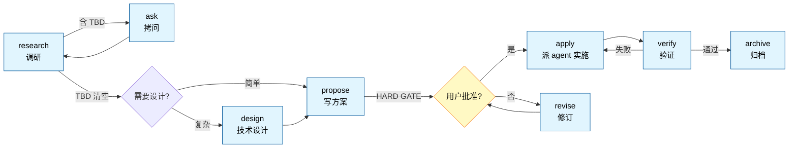

<div align="center">

# spec-workflow

**Spec-driven development plugin for Claude Code**

让大改动可控可回滚——调研、拷问、提案、HARD GATE、实施、验证、归档，每步可重入、可硬约束、可派单。

[](https://github.com/kamioj/spec-workflow)
[](https://github.com/kamioj/spec-workflow)
[](https://docs.claude.com/en/docs/claude-code)
[](LICENSE)

[English](README.md) | **中文**

</div>

---

## Why

AI 辅助的 spec-driven development 已有两种范式：

- **快流**：直接动手，hook 兜底（hookify / superpowers brainstorm 简版）
- **重流**：先 spec 后做，但流程僵化（OpenSpec 4 命令、superpowers brainstorm 9 步）

**spec-workflow 走第三路**：保留"先想清楚再动手"的价值，但把流程拆成 11 个独立 slash 命令——每阶段可重入、可中断、可单点重做。配 3 个硬门 hook 让"该停的地方真停下来"，外加 1 个 Stop 提醒 hook 让"实施收尾必有验证"。

### Comparison

| 维度 | spec-workflow | OpenSpec | superpowers |
|---|---|---|---|
| 阶段控制 | 显式 HARD GATE + hook 拦截 | fluid 软警告 | 9 步硬流程 |
| 待决点 `[TBD]` | 允许 + hook 强制清空 | Open Questions 可滞留 | 严禁，必须当场消解 |
| 命令粒度 | 11 个独立命令 | 4 命令一把梭 | skill-based 单流程 |
| 中途重入 | 每阶段独立调用 | `/opsx:continue` 推进 | 重头来 |
| 反作弊精神 | 命令 + agent 双层 + opt-in flag | 无 | 隐含 |

定位：**单人 + 大改动 + 防呆机制**——比 OpenSpec 严，比 superpowers 灵活。

---

## Quick Start

### Install

```pwsh
# 配 GitHub token（private repo 必需）
$env:GITHUB_TOKEN = "ghp_xxxxxxxxxxxx"

# 注册 marketplace + 装 plugin
claude plugin marketplace add kamioj/spec-workflow
claude plugin install spec@spec-workflow
```

**用 OpenAI Codex CLI？** 同一工作流以 Codex 插件形式从本仓库分发——同样的硬门、同样的工件，命令形式为 `$spec-*` 技能：

```sh
codex plugin marketplace add kamioj/spec-workflow
codex plugin add spec@spec-workflow
```

完整 Codex 安装步骤（`$spec-setup` 补装 agents、一次性 hooks 信任）与已知差异见 [codex/README.md](codex/README.md)。

### 可选依赖（不会自动安装——不装也能完整跑通，插件优雅降级）

Claude Code 插件只分发文件（命令 / hook / agent / 规则），**从不往你机器上装软件**。两个外部工具解锁增强层，均为自愿安装：

| 工具 | 解锁什么 | 安装 | 不装的话 |
|---|---|---|---|
| [ast-grep](https://github.com/ast-grep/ast-grep) | charter 审计的机器扫描（`rules/dirty-data/`，AST 级检测吞异常/catch 返默认值） | `scoop install main/ast-grep` 或 `npm i -g @ast-grep/cli` | verifier 退回手工模式，并在 Evidence 里如实声明 `not run` |
| Codex CLI | `/spec:propose` 与 `/spec:verify` 的 `--codex` 异构他审 | `npm i -g @openai/codex`，然后运行一次 `codex`——首次运行会引导完成登录 | `--codex` 不可用；默认的独立审查不受影响 |

### Try it

启动 claude 后：

```
/spec:status                          # 应输出"无活跃 SDD change"
/spec:research "Caffeine vs Redis"    # 开一个调研
```

3 分钟内 `research.md` 会落在 `spec/changes/caffeine-vs-redis/` 目录里。

接下来照流程走：`/spec:ask` 和你一起消化待决的 `[TBD]` → `/spec:propose` 写提案并**在 HARD GATE 停下等你批准** → `/spec:apply` 实施 → `/spec:verify` 独立审查 → 想收尾时说"归档"。迷路了就 `/spec:status`，它会告诉你在哪一步、下一步跑什么。

想整体托管？`/spec:workflow <task>` 端到端自动跑，全程只在**两个点**停下：HARD GATE（审提案——代理替你做的决定全部亮明，不可逆的置顶）和验收（说"归档"）。中途零提问：待决点在内部分诊消化，提案出闸前先被对抗批评面板攻击一轮；你在两个触点给出的评价驱动不限轮数的改进——每条评价都会被逐条回应（采纳 / 有理由地反驳 / 部分采纳），绝不照单全收。

---

## Features

### 11 个独立 slash 命令

| 类别 | 命令 | 做什么 |
|---|---|---|
| **入口** | `/spec:workflow <task>` | 全流程托管——待决点内部分诊，只停 HARD GATE + 验收两个点 |
|  | `/spec:status` | 报告当前 change 在哪一步 |
| **信息收集** | `/spec:research <方向>` | 调研业界做法，标 `[TBD]` |
|  | `/spec:ask` | 拷问消化 `[TBD]` |
|  | `/spec:chat` | 讨论模式，不动文档 |
| **设计 & 方案** | `/spec:design` | 技术设计梳理（按需） |
|  | `/spec:propose [--codex]` | 写 proposal + HARD GATE；`--codex` 让 codex 挑刺方案 |
|  | `/spec:revise [why\|what\|how\|risk]` | 局部改 proposal |
| **执行 & 验证** | `/spec:apply [flags]` | 派 agent 实施 |
|  | `/spec:verify [--codex] [--fix]` | 独立验证代理审查（三维 + charter 审计）；`--codex` codex 异构他审，`--fix` codex 直接改 |
| **收尾** | `/spec:archive` | 归档当前 change |

### 4 个 Hook——3 个硬门 + 1 个提醒

`UserPromptSubmit` 事件上 **shell 脚本拦截**违反流程的命令；`Stop` 事件上一个提醒 hook 兜住"实施结束没验证"：

| Hook | 何时触发 | 做什么 |
|---|---|---|
| `check-tbd.ps1` | `/spec:propose` 之前 | research.md 还有 `[TBD-N]` 就拒绝执行 |
| `check-gate.ps1` | `/spec:apply` 之前 | 前置条件不齐就拒绝：proposal.md 缺失/缺节（四节），或活跃 change 不唯一 |
| `check-archive.ps1` | `/spec:archive` 之前 | change 绕过了流程（proposal 未过 gate / tasks 有未完成项 / 没有 proposal）就拒绝；有意为之时说 `force` 或 `abandoned` 放行 |
| `check-verify-reminder.ps1` | Stop（Claude 结束回合时） | 活跃 change 已 APPROVED 但没有 verify.md 账本 → 把 Claude 顶回去补收尾验证（或明说"在等用户决策"再停）；每次 stop 最多提醒一次，防死循环 |

**软约束 vs 硬约束**：prompt 里写"必须做 X"，模型可能违反；hook 是 shell 脚本拦截，**违反率 0**。

### 1 个开发 Agent（按 scope 派遣）

| scope | 负责 |
|---|---|
| `frontend` | UI / 路由 / 组件 / 样式 / 客户端交互 |
| `backend` | 服务端逻辑 / API / 数据模型 / DB 迁移 / 中间件 |

`spec-dev` 一个 agent，前端 / 后端是派遣时传的 scope。跨前后端项目，接口契约先固化在 `design.md ## Interfaces`，**并发派两个 `spec-dev`**（一 frontend、一 backend）并行实施（不串行）。

### 1 个验证 Agent（全新上下文）

`spec-verifier` 由 `/spec:verify` 派遣，**刻意给全新上下文**——写代码的对话不再自审。协议：无新鲜证据不得判 pass（dev agent 自报的成功要复跑，不采信）、证据先行（引用不出真实代码 = 不算发现，每维度上限 3 条）、反驳轮（辩护必须引用 gate 决策原文）、ast-grep 机器扫描自带 `rules/dirty-data/` 规则包（已实测：连"打了日志仍 return null"都能抓，正常 throw 零误报）。

### opt-in 增强 flag

`/spec:apply` 默认轻量。三个 flag 按需启用：

| flag | 启用规则 | 适用场景 |
|---|---|---|
| `design` | 反 AI slop | 营销页 / 作品集 / 视觉重要的前端 |
| `solid` | 反偷懒（禁 workaround） | 一次性脚本怕走捷径 |
| `verify` | 反幻觉（先读再写） | 复杂代码库怕乱猜 |

可组合：

```
/spec:apply design solid verify    # 三件套全启
```

---

## Workflow



每个阶段独立。不顺手随时跳——`/spec:chat` 讨论、`/spec:revise why` 改某段、`/spec:research <新方向>` 重做调研。

---

## Architecture

### Repo layout

```
.
├── .claude-plugin/
│   ├── marketplace.json           # marketplace 清单（source: "./" 自指仓库根）
│   └── plugin.json                # plugin 清单
├── core/                           # 两端全部 markdown 的单一事实源
├── tools/generate.mjs              # 从 core/ 生成 commands/ skills/ rules/ agents/ 与 codex/skills|agents；--check 防漂移
├── codex/                          # OpenAI Codex CLI 移植版（同流程同硬门；见 codex/README.md）
├── commands/                       # 11 个 slash 命令——由 core/ 生成，勿手改
├── hooks/                          # 硬约束（pwsh 实现）
│   ├── hooks.json
│   ├── check-tbd.ps1
│   ├── check-gate.ps1
│   ├── check-archive.ps1
│   └── check-verify-reminder.ps1
├── agents/
│   ├── spec-dev.md                 # 按 scope（frontend/backend）派遣；跨栈并发派两个
│   └── spec-verifier.md            # /spec:verify 派遣的全新上下文验证者
├── rules/                          # ast-grep 规则包（charter 审计机器扫描）
│   ├── sgconfig.yml
│   └── dirty-data/                 # 吞异常 / catch 返默认值（java/js/ts）
├── scripts/
│   └── codex-exec.ps1              # 所有 --codex 调用的统一包装（超时 / 会话复用 / Windows 兼容）
└── skills/core/
    ├── SKILL.md                    # plugin 总览（共享精神）
    └── references/                 # 知识库
        ├── proposal-spec.md        # 产物 spec：完整格式 + HARD GATE 规则
        ├── design-spec.md
        ├── tasks-spec.md
        ├── agent-principles.md     # opt-in: 反偷懒 + 反幻觉
        ├── frontend-aesthetics.md  # opt-in: 反 AI slop
        ├── code-charter.md         # 编码期基线: fail-fast / 反静默兜底 / 不留旧逻辑回退
        ├── alibaba-java.md         # 14 个语言/框架规范
        ├── bulletproof-react.md
        ├── vue-style.md vue-patterns.md
        ├── react-patterns.md
        ├── ts-conventions.md google-ts-style.md
        ├── python-conventions.md php-conventions.md
        ├── flutter-conventions.md
        ├── js-style.md css-style.md
        └── uniapp-miniprogram.md
```

### Runtime artifacts

在你的项目里跑 sdd plugin 时产生的文件：

```
<your-project>/spec/
├── knowledge.md                    # 项目级恒定事实（跨 change 沉淀；archive 维护、research 先读）
├── changes/<change-name>/          # 活跃 change 工作区
│   ├── research.md   必有          # 当前调研（Practices + Constraints + Open[TBD] + Decided，单文件）
│   ├── research/     可选          # 调研方向废稿堆（被弃方向的 research.md 快照，无标记无链接，可复活）
│   ├── design.md     可选          # 技术设计（架构 / 接口 / 数据模型）
│   ├── proposal.md   必有          # 方案终态（含 APPROVED 标记）
│   ├── tasks.md      可选          # 多执行体协作清单
│   ├── verify.md     验证时生成    # 验证账本：稳定发现编号 + 轮次对比 + 未修复升级
│   └── retrospect.md 归档时生成    # /spec:archive 写入：偏差审查 + 验证证据 + 遗留事项
└── archive/<YYYY-MM-DD-name>/      # 已归档 change
```

---

## Development

修改 plugin 内容后：

```pwsh
git add . && git commit -m "..."
git push

claude plugin marketplace update spec-workflow    # 同步 cache
# 重启 claude（hook 必须重启加载）
```

或开发期跳过 push 循环，直接加载本地源码：

```pwsh
claude --plugin-dir .
```

`--plugin-dir` 加载的副本**优先级高于** marketplace cache，改了立刻能测。

---

## Documentation

- [skills/core/SKILL.md](skills/core/SKILL.md) — 共享精神（HARD GATE / 拷问规则 / 卡死保护 / 反作弊）
- [Claude Code Plugin 官方文档](https://code.claude.com/docs/en/plugins) — 上游 plugin 机制参考

---

## Limitations

- **Claude Code 侧 hooks 仅限 Windows**：Claude 侧门用 PowerShell 写，跨平台需要 bash/sh 等价实现。（Codex 移植版的 4 个门已带 pwsh + POSIX sh 双实现）
  - 机器上**不要求装 PowerShell 7**：hook 入口是每台 Windows 都自带的 `powershell.exe`，由 `hooks/gate-launcher.ps1` 运行时探测 pwsh（PATH → MSI 默认目录 → Store 别名），找到就委托，找不到就在 5.1 进程内直接跑门。尤其是 Microsoft Store 版 PowerShell 7（其可执行文件只是每用户的应用执行别名，hook 进程的 PATH 查找看不见它）不再导致门失效。
- **未做的扩展**：sdd-researcher / sdd-reviewer 专属 agent / MCP server

---

## Integration

与全局 CLAUDE.md 协议的协作约定：

- **语言**：proposal / research 内容跟随你的工作语言；段标题英文（## Why / ## What / ## How / ## Risk）便于工具识别和 revise 参数化
- **子代理委派**：research 阶段派全局 `@researcher`、apply 阶段派 plugin 内 `spec-dev`（按 scope）
- **并发**：互不依赖的任务一次性并发派单

---

## Verified Decisions

调研后确认无问题的设计点（曾担心过；证据引用 Claude Code 官方 plugin-dev 插件与 hookify 源码，安装它们可复核）：

| 项 | 结论 | 证据 |
|---|---|---|
| `user_prompt` 字段名 | ✅ 正确 | hookify/core/rule_engine.py 第 226-228 行实际访问 `input_data.get('user_prompt', '')` |
| plugin agent 调用方式 | ✅ 直接用 agent name（`spec-dev`），无需 plugin 前缀 | plugin-dev/skills/agent-development/SKILL.md § Namespacing |
| agent frontmatter 必填字段 | ✅ name / description / model / color 全部就位 | plugin-dev/skills/agent-development/SKILL.md § Frontmatter Fields |
| agent model 策略 | ✅ `inherit`（继承父对话模型，官方推荐） | plugin-dev/skills/agent-development/SKILL.md § model |

---

## Changelog

- **0.4.1** — Codex 端规则包路径修复：verifier 的 ast-grep 指令只指向插件化之前的脚本安装位，插件安装的用户会静默失去机器扫描（真实飞行中以 `not run` 声明暴露）。生成文本现在跨两个安装根定位 `sgconfig.yml`（插件缓存 + `~/.agents/skills`），sh/pwsh 双平台实测通过；`codex/AGENTS.md` 的安装路径描述改为安装方式无关。
- **0.4.0** — `/spec:workflow` 成为真正的两触点自动驾驶：
  - 待决点**分诊代替提问**：有证据的直接定，可逆偏好自决并标 `auto`，不可逆/产品语义的临时拍板标 `escalated`——置顶 HARD GATE 亮明，沉默即默认生效，apply 开工首行再回显一次
  - 提案出闸前先过**批评面板**：首席"必要性反驳"批评者（四问反驳；没有真实触发场景的静默兜底吃删除裁定，响亮的不变量护栏按爆炸半径评审而非历史事故）+ 回归兼容 + 可测性，安全/性能按内容加编；一轮反驳收敛，findings 以 round 0 落验证账本
  - gate 的 Changes 块改为**同一具体场景的前后镜像**（Problem / After / Cost，各 ≤2 行）——非开发者也能读懂
  - 你的反馈成为一等回路：闸口与验收的评价获得逐条采纳/反驳/部分采纳回应，被采纳项以 user-sourced findings 进账本，改进轮数不设上限（代理内循环仍封顶：反驳一轮、自动修复两轮）
  - `/spec:status` 从工件现算里程碑视图（轮次、决策、触点位置）——零新增存储，永不漂移；归档 retrospect 增加自决校准项，反哺 `spec/knowledge.md`
- **0.3.0 – 0.3.3** — 双端时代：同一套工作流以 OpenAI Codex CLI 插件形态从本仓发布（`codex/`、`$spec-x` skills、pwsh+sh 双胞胎门 hook + 40 用例夹具）；两棵插件树由单一 `core/` 源生成（`tools/generate.mjs --check` 防漂移）；Claude 侧 hook 换 `powershell.exe` 托管的探测降级 launcher——Store 版 PowerShell 7 不再静默瘫痪三道门（0.3.3）；ask 选项改字母编号避免与题号连读（0.3.2）；代理派发契约修正（0.3.1）
- **0.2.1 – 0.2.3** — 首批真实运行 + 两轮独立审计的实战加固：
  - verifier 输出枚举纪律（0.2.1）
  - 门 hook 只在调用时触发、提及不拦——"apply 是干嘛的"这类提问正常放行（0.2.2）
  - apply 门改查前置条件（proposal 存在 + 四节齐全 + 单活跃 change）而非 APPROVED 标记，修复一个 happy path 死锁（hook 要求的标记只有 apply 自己才能盖）；修复 `--codex` 工具权限（`/spec:propose --codex` 此前无法执行脚本）；扫平文档漂移（0.2.3）
- **0.2.0**
  - HARD GATE 增加讲解层：Changes 按"场景 → 如何避免 → 代价"写给决策者，并强制披露"未询问自决项"与"不在本次范围"
  - proposal `## What` 每项带 `verify:` 验收条，节尾必有 **Not in this change** 范围边界，且贯穿到 agent 派单与 verify 排除区
  - `/spec:verify` 改为派遣独立全新上下文的 `spec-verifier` agent（证据先行、反驳轮、可选 ast-grep 机器扫描 `rules/dirty-data/`），并落盘验证账本 `verify.md`（稳定发现编号 + 轮次对比 + 未修复项升级为 fail）
  - charter 审计：兜底/降级/兼容路径必须溯源到 gate 决策，溯源不到即缺陷（数据写路径为 critical）；spec-dev 汇报强制披露每个 fallback 与 Evidence
  - 新增两个 hook：`check-archive.ps1`（拦截绕流程归档，`force`/`abandoned` 显式放行）、`check-verify-reminder.ps1`（Stop 事件：回合不能在"已批准但无验证账本"状态下静默结束）
  - 新增工件：归档复盘 `retrospect.md`（偏差审查 + 证据）、项目级 `spec/knowledge.md`（跨 change 沉淀，archive 维护、research 先读）
  - tasks.md 的生成决策在 gate 上显式声明（触发条件 + 拆分），不再静默附带
- **0.1.0** — 首版：11 命令 + 2 hook + 1 agent，从 skill 形态迁移而来

---

## License

本仓库采用 [MIT License](LICENSE)。

**`references/` 内容声明**：

- 全部为 sdd **自有内容**。其中技术栈规范（`js-style` / `vue-style` / `google-ts-style` / `alibaba-java` 等）是对应官方规范**关键要点的自有提炼**，已在各文件 frontmatter 的 `source` 字段注明参考来源——需要完整规范请访问官方链接，本项目不复制原文。
- `bulletproof-react.md` 为基于 [bulletproof-react](https://github.com/alan2207/bulletproof-react)（MIT）的要点摘要。
- `agent-principles.md` / `frontend-aesthetics.md` 的原则为自有表述，综合业界通用工程 / 设计共识整理。

---

<div align="center">

Built with [Claude Code](https://claude.com/claude-code) · Maintained by [@kamioj](https://github.com/kamioj)

</div>
