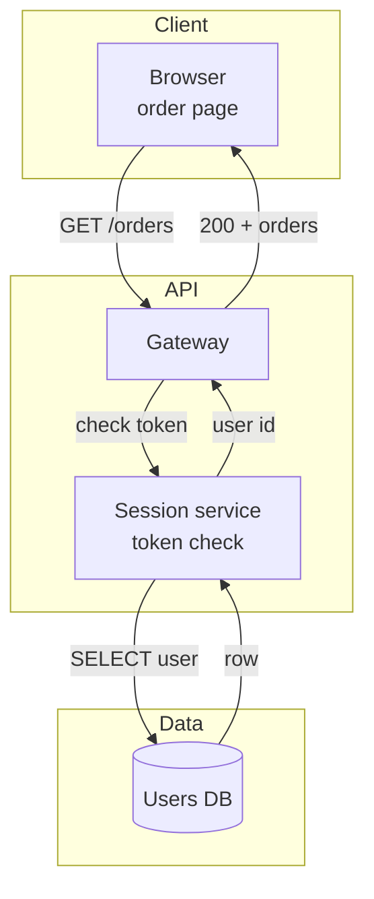
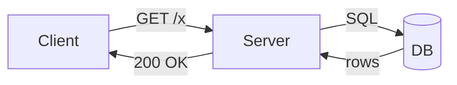
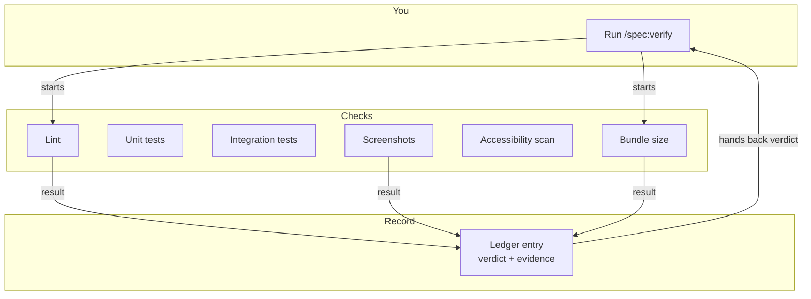
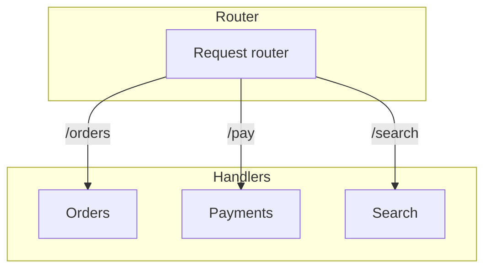

# Design: request-response

## Architecture

```mermaid
flowchart TD
  subgraph Client
    U["Browser<br/>order page"]
  end
  subgraph API
    G["Gateway"]
    S["Session service<br/>token check"]
  end
  subgraph Data
    D[("Users DB")]
  end
  U -->|GET /orders| G
  G -->|200 + orders| U
  G -->|check token| S
  S -->|user id| G
  S -->|SELECT user| D
  D -->|row| S
```

```mermaid
flowchart LR
  A[Client] -->|GET /x| B[Server]
  B -->|200 OK| A
  B -->|SQL| C[(DB)]
  C -->|rows| B
```

```mermaid
flowchart TD
  subgraph You
    Y["Run /spec:verify"]
  end
  subgraph Checks
    C1["Lint"]:::new
    C2["Unit tests"]:::new
    C3["Integration tests"]:::new
    C4["Screenshots"]:::new
    C5["Accessibility scan"]:::new
    C6["Bundle size"]:::new
  end
  subgraph Record
    R["Ledger entry<br/>verdict + evidence"]
  end
  Y -->|starts| C1
  Y -->|starts| C6
  C1 -->|result| R
  C4 -->|result| R
  C6 -->|result| R
  R -->|hands back verdict| Y
```

```mermaid
flowchart TD
  subgraph Router
    Q["Request router"]
  end
  subgraph Handlers
    H1["Orders"]
    H2["Payments"]
    H3["Search"]
  end
  Q -->|/orders| H1
  Q -->|/pay| H2
  Q -->|/search| H3
```

## Interfaces
- **Orders**: `GET /orders` returns the signed-in user's orders
